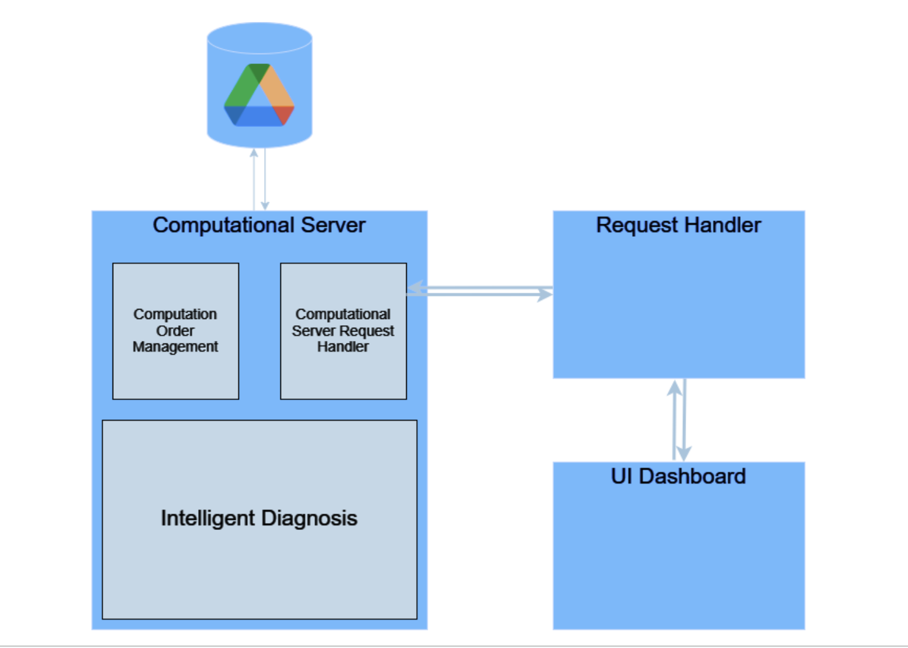

# Flight Scope Analytics

## Overview
Flight Scope Analytics is an innovative project aimed at enhancing the efficiency and accuracy of diagnosing issues in aircraft through the analysis of black box data. Utilizing Explainable AI (XAI) techniques, this project identifies and explains anomalies in flight data, significantly aiding technicians in their maintenance tasks. Developed beyond the initial scope of a machine learning demonstration, Flight Scope Analytics is a full-stack software solution designed to streamline the error identification process in aviation maintenance.

## Aim
The project's primary goal is to reduce the time and effort required by aviation technicians to pinpoint and understand anomalies reported during flights. By automating the analysis of flight black box data and providing explainable insights, technicians can directly address issues without the need for extensive manual data review.

## Features
- **Real-World Flight Data Analysis:** Utilizes actual flight data to identify and explain anomalies.
- **Explainable AI Techniques:** Employs state-of-the-art XAI methods to elucidate the reasons behind identified anomalies.
- **Secure Data Handling:** Adheres to strict data security protocols, ensuring compliance with NDA requirements through innovative server hosting within Google Collab.
- **Interactive Dashboard:** Offers a user-friendly dashboard built with React for easy visualization and interpretation of flight data anomalies.
- **RESTful Services:** Incorporates Flask and ngrok to create a secure, efficient backend service for handling user requests and computational tasks.

## Technologies Used
- **Machine Learning & AI:** Python (for ML models and server hosting within Google Collab)
- **Backend:** Flask (for RESTful services), ngrok (for global port exposure)
- **Frontend:** React (for dashboard development)
- **Data Security:** Google Collab (for secure data access and processing)

## Architecture Diagram
    
  
## Challenges and Solutions
- **Data Security:** Faced with the challenge of adhering to an NDA for data security, we innovated by hosting servers within Google Collab, ensuring data never left the secure environment while still being accessible for analysis.
- **Server Deployment:** Deploying servers from Collab presented initial difficulties, especially in exposing ports globally via ngrok. Through perseverance and technical troubleshooting, we established a stable and secure system for project deployment.

## Acknowledgments
A special thanks to our guide and the company that provided us with the real-world flight data, making this project possible. Our team's dedication and hard work were instrumental in overcoming the challenges we faced, and this project would not have been successful without their efforts.

